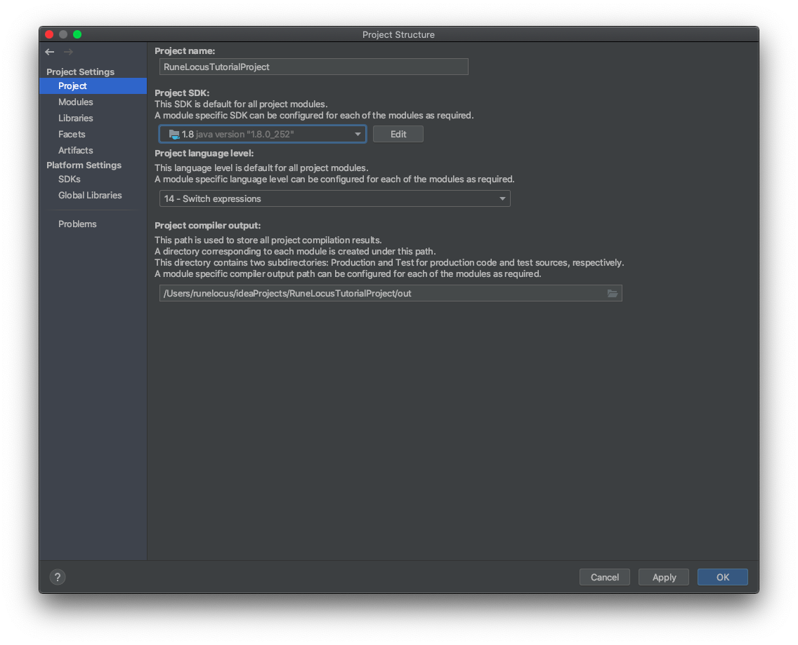

# Hosting an RSPS: IntelliJ
In this part we'll be using IntelliJ to set up our RSPS project. The free edition of IntelliJ (IntelliJ Community Edition) is more than enough for RSPS. You can download it [here](https://www.jetbrains.com/idea/download). The paid version gives more integrations with frameworks and other tools which you don't need.

## Creating the project structure
In the welcome screen of IntelliJ which is presented when no project is open, click on "New Project".

I prefer creating a new project because it lets you create a structure similar to how you would make it in Eclipse.

Once you clicked on it, you'll see a project window appear:

Click on "Empty Project" to tell IntelliJ to create an empty project with nothing in it. Give it a name and we will manually add everything in the next step.

It could be that IntelliJ starts indexing the new JDK. This could take a few minutes depending on your hardware but this should only happen once. Wait for it to complete (progress bar in the bottom right).

## Adding modules
Now that we have an empty project, IntelliJ will automatically open the project structure settings:

If the window did not appear, you can open it via
`File > Project Structure`.

Before you make any modules, select the Project SDK:

Remember earlier in the tutorial I mentioned that RSPS works best with JDK 8? Here you will add the JDK to IntelliJ. 

This is a step that only needs to happen once for every JDK. 
If you chose not to install manually, IntelliJ can download and install the JDK as well. Just click on the dropdown menu and click on "Download JDK".

Alternatively, if you did download the JDK in the previous step, IntelliJ will detect it on your system.

### Client module
To make the client module, create a new module like this:

A new window will appear to specify what kind of module you want to create.

Give it a name and make sure it sits under the project root (RuneLocusTutorialProject in my case) like this:

Click next and then the module is created. We still need to modify the module output settings. In fact this is an optional step, but it follows the style how Eclipse does it, so to avoid confusion, let's make it the same.

Notice the `Client/bin` path in Output path. This means that compiled classes will end up in the `bin` folder in the `Client` module. RSPS doesn't really have tests so the Test output path can remain the default.

Press "OK" and the module is ready.

### Server module
It's really the same thing with the server module, so repeat the steps for the Client module, but replace all "Client" names with "Server". **Don't forget to put the folder under the project root!** *(Example: RuneLocusTutorialProject/Server).*

## Adding the code and libraries
### The client
### The server

## Creating run configurations
### Client
### Server

## Creating jar outputs
### Client
### Server

## Running the server
### (Linux) Systemd service
### Batch/Bash file

## Port forwarding

---------------------
Your server is all good to go! I hope you enjoyed the tutorial and if you have questions, feel free to ask them on the [RuneLocus](https://runelocus.com) Discord.